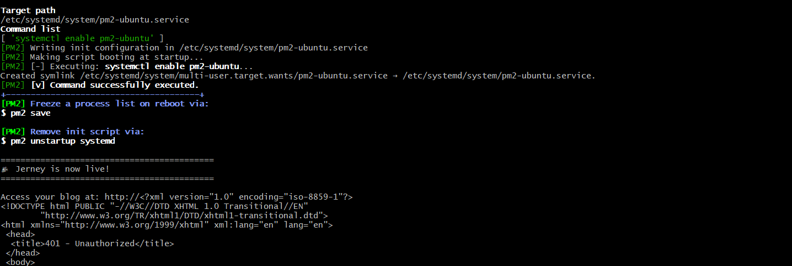
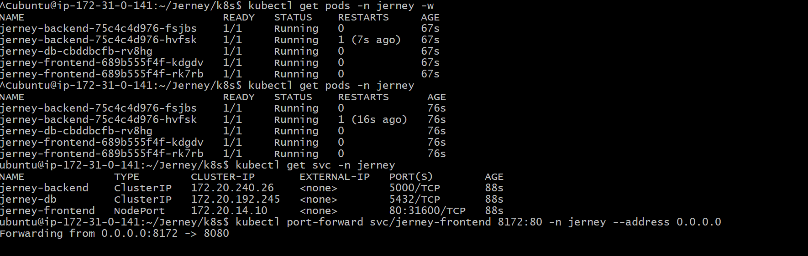
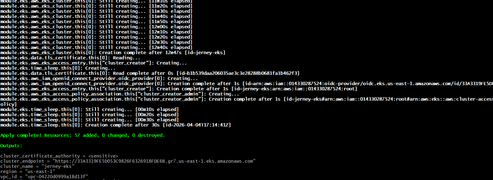
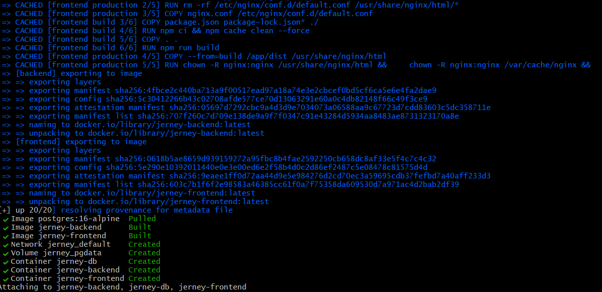

# 🚀 Jerney Application Deployment on AWS EKS

## 📌 Project Overview
This project demonstrates deployment of a full-stack **Jerney application** using modern DevOps tools and AWS services.

The application is containerized using Docker, deployed on AWS EKS, and infrastructure is provisioned using Terraform. Security is enhanced using Kubernetes Network Policies, and auto-scaling is handled by Karpenter.

---

## 🏗️ Architecture

- Frontend & Backend containerized using Docker
- Local testing using Docker Compose
- Infrastructure provisioned using Terraform (IaC)
- Deployed on AWS EKS cluster
- Auto-scaling implemented using Karpenter
- Secure communication using Kubernetes Network Policies

---

## ⚙️ Technologies Used

- AWS EKS
- Terraform
- Docker & Docker Compose
- Kubernetes
- Karpenter
- Kubernetes Network Policies
- GitHub

---

## 📷 Screenshots

### ✅ Requirements Installed

---

### 💻 Application Running Locally

---

### ☸️ Kubernetes Deployment

---

### 🏗️ Terraform Infrastructure Creation

---

### 🐳 Docker Compose Setup

---

## 🚀 Deployment Steps

1. Clone the repository  
2. Build Docker images using Dockerfiles  
3. Run application locally using Docker Compose  
4. Provision infrastructure using Terraform  
5. Configure EKS cluster  
6. Deploy application using Kubernetes manifests  
7. Apply Network Policies for secure communication  

---

## 🔐 Security Implementation

- Implemented Kubernetes Network Policies to control traffic between services  
- Only frontend pods are allowed to communicate with backend  
- Applied deny-all policy as a baseline security model  
- Allowed only required traffic such as DNS and internal communication  

---

## 📌 Features

- Infrastructure as Code using Terraform  
- Scalable Kubernetes deployment on AWS EKS  
- Automated node provisioning using Karpenter  
- Multi-container application using Docker  
- Custom Dockerfiles for frontend and backend  
- Secure communication using Kubernetes Network Policies  

---
## ⚠️ Note

- CI/CD pipeline is currently under improvement  
- Project focuses on real-world DevOps practices including security and scalability  

